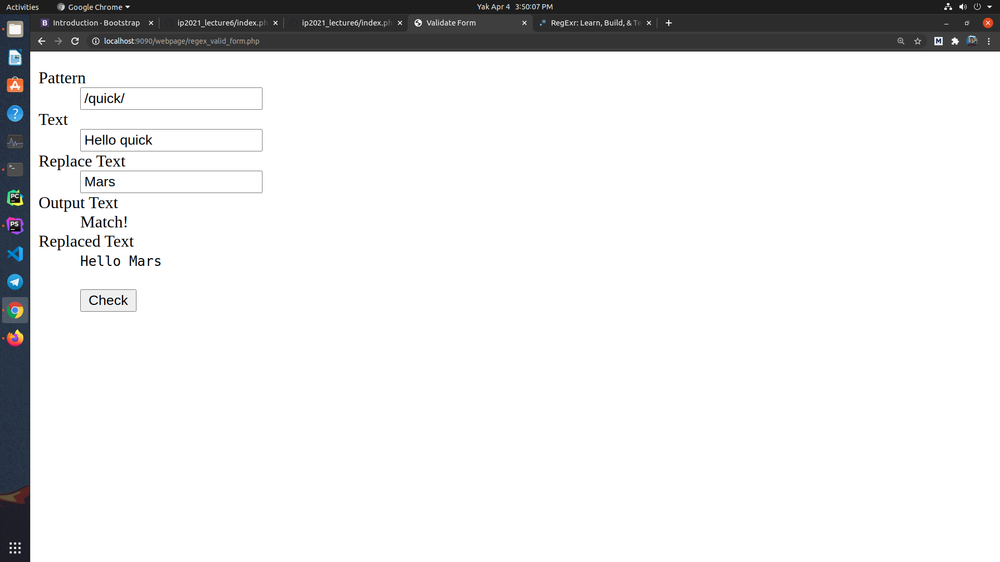

# Lab Assignment 6

- Student: Rustam Zokirov
- ID: U1910049
- Section: 002

## Extra
- Video lecture - https://www.youtube.com/watch?v=bvQZ7HkCKNg
- https://t.me/iut_ip2021/22

## Checkpoints

# Extra
- Video lecture - https://www.youtube.com/watch?v=bvQZ7HkCKNg
- https://t.me/iut_ip2021/22
